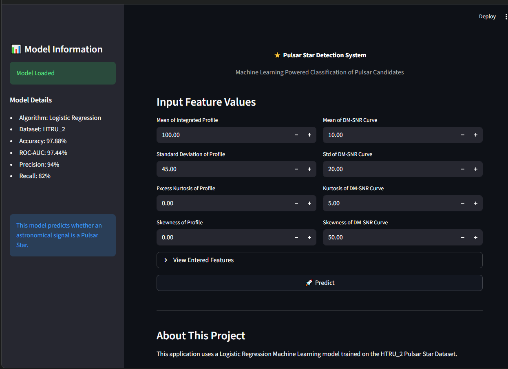
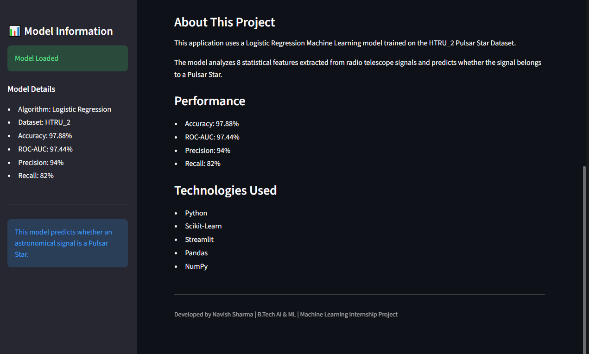
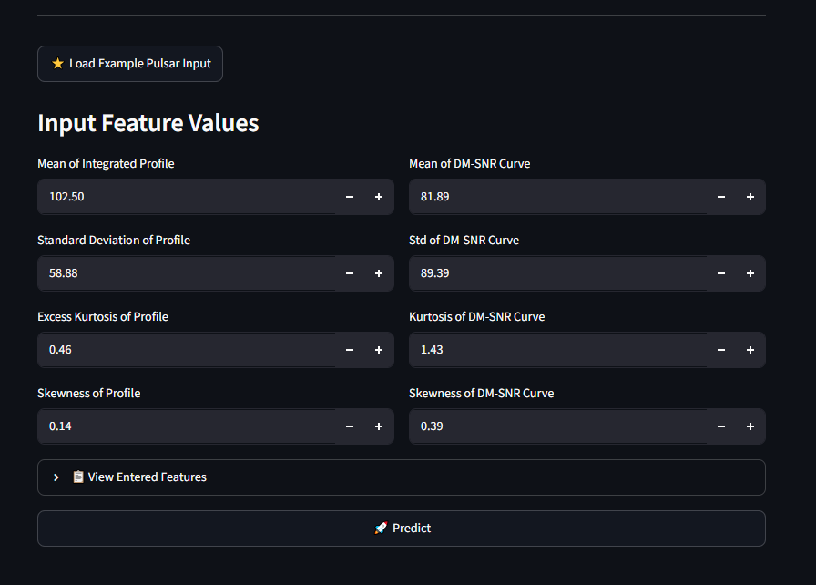
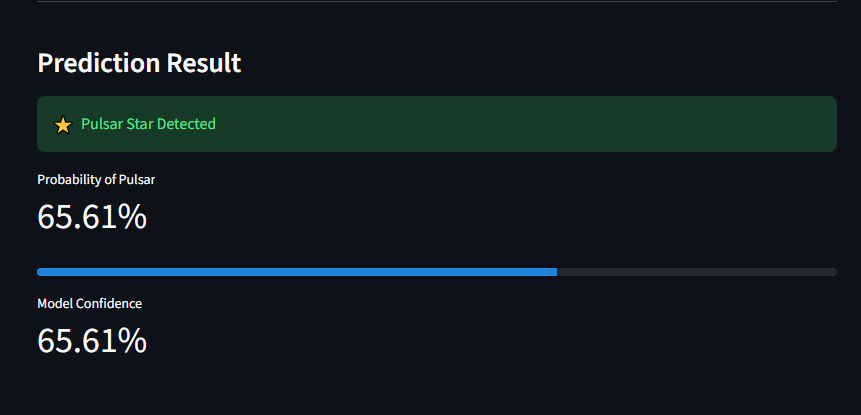

# ⭐ Pulsar Star Detection System

A Machine Learning web application built using **Logistic Regression** and **Streamlit** to classify astronomical signals as **Pulsar Stars** or **Non-Pulsar Stars**.

---

## 📌 Project Overview

Pulsars are highly magnetized rotating neutron stars that emit beams of electromagnetic radiation. Identifying pulsars from radio telescope data is a challenging classification task due to the large volume of signals generated.

This project leverages Machine Learning to automate pulsar candidate classification using statistical features extracted from radio signals.

---

## 🎯 Objectives

- Perform Exploratory Data Analysis (EDA)
- Handle class imbalance
- Train a Logistic Regression model
- Evaluate model performance using multiple metrics
- Build an interactive Streamlit web application
- Deploy the application for real-world usage

---

## 📂 Dataset

Dataset Used: **HTRU_2 Pulsar Star Dataset**

Features:

| Feature |
|----------|
| Mean of Integrated Profile |
| Standard Deviation of Integrated Profile |
| Excess Kurtosis of Integrated Profile |
| Skewness of Integrated Profile |
| Mean of DM-SNR Curve |
| Standard Deviation of DM-SNR Curve |
| Excess Kurtosis of DM-SNR Curve |
| Skewness of DM-SNR Curve |

Target:

- 0 → Non Pulsar
- 1 → Pulsar

---

## 🔍 Exploratory Data Analysis

The following analyses were performed:

- Missing Value Analysis
- Statistical Summary
- Class Distribution Analysis
- Correlation Heatmap
- Outlier Detection using Boxplots

Key Observations:

- Dataset is imbalanced (~90:10)
- Strong correlation observed between:
  - Kurtosis Profile
  - Skewness Profile
- Significant outliers exist in several features

---

## 🤖 Machine Learning Model

### Algorithm

Logistic Regression

### Data Preprocessing

- Train-Test Split
- Feature Scaling using StandardScaler
- Stratified Sampling

---

## 📊 Model Performance

| Metric | Score |
|----------|----------|
| Accuracy | 97.88% |
| Precision | 94% |
| Recall | 82% |
| F1 Score | 87% |
| ROC-AUC | 97.44% |

### Interpretation

The model demonstrates excellent discriminative ability with a ROC-AUC score above 97%.

The small difference between training and testing accuracy indicates strong generalization and minimal overfitting.

---

## 🖥️ Streamlit Application

Features:

- User-friendly interface
- Real-time prediction
- Probability estimation
- Feature input validation
- Model information dashboard

---

## 🚀 Installation

Clone the repository:

```bash
git clone https://github.com/steeltroops11/Ducat_Data_Science_Training_PCTE.git
```

Move to project directory:

```bash
cd Pulsar_Star_Detection
```

Install dependencies:

```bash
pip install -r requirements.txt
```

Run Streamlit application:

```bash
streamlit run app.py
```

---

## 📦 Requirements

```text
streamlit
numpy
pandas
scikit-learn
joblib
```

---

## 📸 Screenshots

### Home Page



### About Section



### Input Features



### Prediction Result



---

## 🛠️ Technologies Used

- Python
- NumPy
- Pandas
- Scikit-Learn
- Streamlit
- Joblib
- Matplotlib
- Seaborn

---

## 📈 Future Improvements

- Random Forest Comparison
- XGBoost Implementation
- Hyperparameter Optimization
- Docker Deployment
- Cloud Deployment
- Explainable AI using SHAP

---

## 👨‍💻 Author

**Navish Sharma**

B.Tech Artificial Intelligence & Machine Learning

PCTE Institute of Engineering & Technology

GitHub: https://github.com/steeltroops11

---

## 📄 License

This project is developed for educational and internship purposes.
